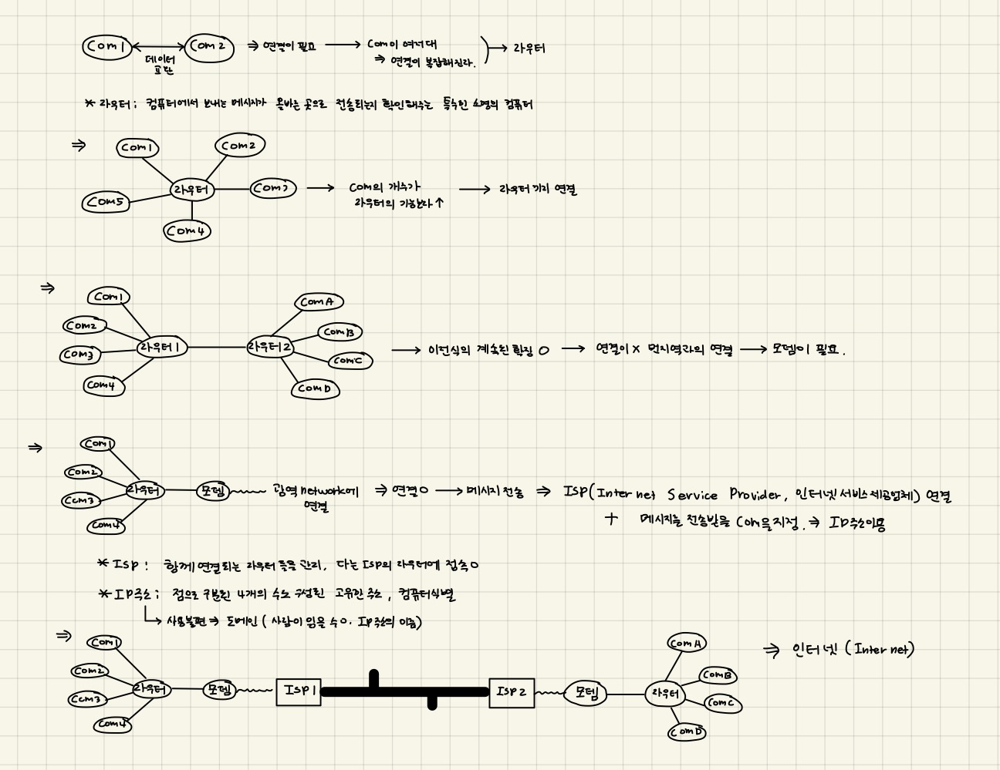
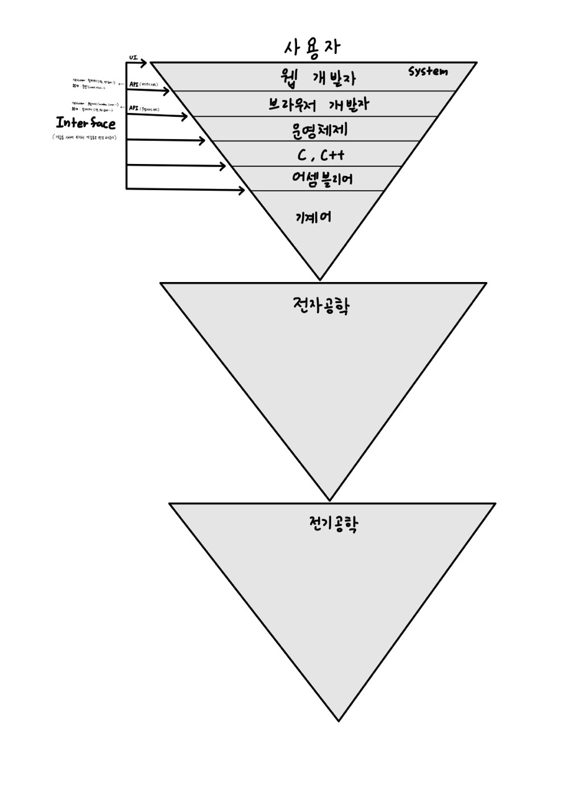

# Web 개발 RoadMap 따라가기

***
## 인터넷이란?
1. 인터넷(internet)이란? : 인터네트워크(inter-network)의 약자, 웹의 핵심적인 기술, 컴퓨터 들이 통신 가능한 거대한 네트워크 
2. 인터넥의 구성( 클라이언트 + 서버 = 네트워크, 네트워크의 집합체 ⇒ 인터넷)  
   *컴퓨터네트워크 : 여러대의 컴퓨터가 각가 클라인언트와 서버로 구성된 망
3. 이용 프로토콜 : TCP/IP
4. 특징 : 쌍방향 통신 제공, 메시지 송수신에 시간 제약이 없다.  
**⇒ 인터넷은 TCP/IP 라는 통신 프로토콜을 이용해 정보를 주고 받는 컴퓨터 네트워크이다.**
5. 인터넷의 연결  
  
6. 인터넷과 웹의 관계  
   - 인터넷 ⇒ 수십억대의 컴퓨터를 연결하는 기술 인프라  
   - 인터넷 ⇒ 수십억대의 컴퓨터를 연결하는 기술 인프라  
   **⇒ 인터넷: 인프라, 웹 : 인터넷 위에 구축 된 서비스 중 하나이다.**    
   *웹 외에 인터넷 위에 구축 된 서비스 : 이메일, IRC (en-Us) 등

***
## WEB이란?
1. Web : 월드 와일드 웹(World Wide Web)의 약자로 인터넷에 연결된 사용자들이 서로의 정보를 공유하는 공간이다. 인터넷 위의 하나의 서비스이다.  
2. Web의 특징 : 웹은 인터넷 상에서 멀티미디어 정볼르 하이퍼 텍스트 방식으로 연결하여 제공하는 서비스이다.  
 *하이퍼텍스트(Hypertext) : 하이퍼링크를 통해 웹 상의 문서를 연결해주는 기술이다. 
3. Web page VS Web site VS Web Browser  
   - Web page : html언어르 이용하여 작성된 문서  
   - Web site : 하이퍼링크를 이용해 연결된 서로 연관있는 Web page들의 집합  
   - Web Browser : Web page를 검색하기 위해 사용하는 프로그램  

***
## WEB 개발 관련 용어 정리
1. front-end : 이용자의 웹 브라우저가 직접적으로 보이는 부분을 다루는 기술 , html, css, javascript이 기본, 추가적으로 프레임 워크를 사용  
2. 프레임워크 : 응용프로그램이나 소프트웨어의 솔류션 개발을 수월하게 하기 위해 제공된 소프트웨어 환경, 목적에 따라 효율적으로 구조를 짜놓은 개발 환경(프로그램의 기본 구조, 뼈대)  
 - 확장 가능한 기반 코드를 가지고 있다 ⇒ 특정한 규칙이 정해져있다.→ 프레임워크에 의존하여 개발해야 한다.    
 - 응용 프로그램이 수동적으로 프레임워크에 의해 사용돤다.  
 - 프레임워크 만으로 실행 되지x, 기능 추가가 필요  
 - 디자인 패턴 기반  
 > 대표적 프레임워크 : vue, react, angular, django, spring, larave   
3. 라이브러리 : 응용프로그램 개발을 위해 필요한 기능들을 모아 놓은 소프트웨어(프로그램 제작 시 필요한 기능)    
 - 응용프로그램이 능동적으로 라이브러리를 사용    
 - 부품이 되는 소프트웨어의 집합  
 - class 나 function으로 구성  
 - 엄격한 규칙이 존재x  
 > 대표적 라이브러리 : jQuery  
 > *객체 지향 프로그래밍 : 각 기능마다 함수화 → 일종의 클래스 라이브러리  
4. API(Application Programming Interface): 운영체제나 프로그래밍 언어(기반 시스템)가 제공하는 기능을 응용프로그램이 사용 할 수 있도록 제어 할 수 있게 만든 인터페이스, 기반 시스템과 응용 프로그램 사이를 연결 해주는 인터페이스, 프로그램을 위한 인터페이스  
**⇒ 프로그램들이 서로 상호작용 할 수 있도록 도와주는 매개체(내부 작동 방식을 몰라도 기능을 사용 할 수 있게 해줌)**  
 - 구현과 독립적으로 사양만 정의 되어 있다.  
 > *사용자와 전산학, 전자공학, 전기공학 간의 계층  
 >   
 > 참조 : [API](https://opentutorials.org/course/1189/6205)
  
**API VS 라이브러리 VS 프레임워크**  
- API : 컴포넌트를 사용하는 규약, 호출을 위한 수단, 구현 로직x  
- 라이브러리 : 컴포넌트 자체, 구현 로직o , 코드 컨트롤o    
- 프레임워크 : 규칙에 따라 코드 작성**

